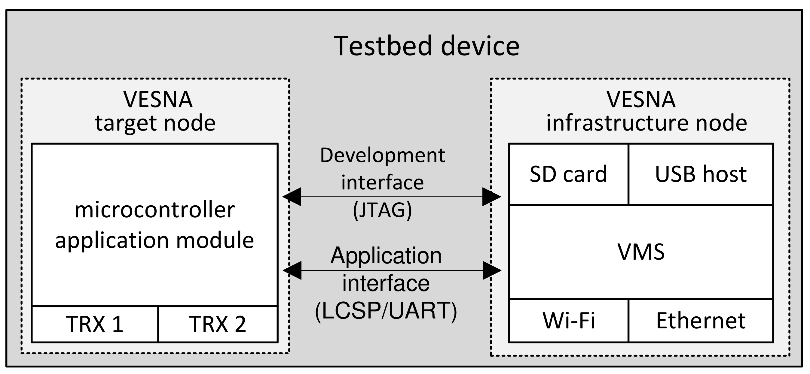
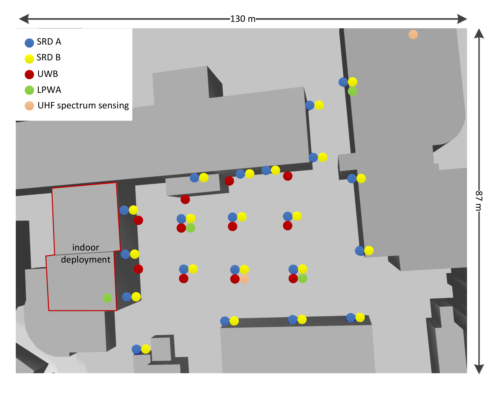

title: Infrastructure node (lgtc)

<!-- vim: linebreak filetype=markdown expandtab ts=4 sw=4
-->

# LGTC

LGTC is a custom designed single board computer based on the BeagleCore module running the Debian GNU/Linux operating system. It is capable of hosting microcontroller-based boards such as VESNA SNC and VESNA SNP.

<figure>
    
    <figcaption>LGTC board.</figcaption>
</figure>

## Connectors

Platform supports Wired Ethernet, WiFI, USB and Bluetooth for connectivity and VESNA and USB interfaces for modular extensibility and a development/debug process. It can be powered with either 230V AC, 12V DC or the 5V supply from the USB gadget.

The Power supply, supports multiple input source options. It can be connected to the Mains 110 V – 230 V AC, 12 V DC or PoE. It delivers power to all the electronics on the board. The BeagleCore module is based on Texas Instruments AM3358 1Ghz ARM Cortex-A8 processor. It has 512 MB DDR3 RAM and 8 GB of eMMC Flash. For additional memory we added uSD card slot. For Internet connectivity we can use Ethernet or WiFi. Ethernet is based on Microchip’s LAN8710 and WiFi on WL1837MOD module. We use WiFi on 5Ghz frequency bands, while 2.4 GHz band is reserved for experimentation. The LGTC also support USB Host and Serial communication.

<figure>
    
    <figcaption>LGTC connectors.</figcaption>
</figure>

## Communication interfaces

For the distributed system of infrastructure network we chose SSH protocol as an integration protocol that combined with Ansible software provisioning system ensures scalable and adaptable distributed system. Ansible is a tool similar to Chef or Puppet but does not require a special agent running on each node, which could introduce a potential point of failure which we would like to avoid. Ansible is agent-less and therefore a more reliable system which is especially important in cases where nodes cannot be accessed easily.

<figure>
    
    <figcaption>Communication interfaces.</figcaption>
</figure>

The integration LGTC nad VESNA is done via custom hardware design and the adoption of selected interfaces and protocols. Both nodes are interconnected via application and development interfaces, providing the exchange of application data as well as remote low-level application debugging. The reliable development interface is based on JTAG and the application interface on protocols such as LCSP (Light-weight Client Server Protocol) or SLIP (Serial Line Internet Protocol) running on top of serial interface.

## Deployment

All before mentioned parts are placed on custom PCB which fits in weatherproof IP67 enclosure of 15 cm x 11 cm x 4 cm. Since the nodes are located indoor as well as outdoors, we designed two different assembly variants. To achieve maximum water resistance, the outdoor variant support only 5 external connectors. 4 SMA connectors for antennas and one cable gland for power supply. Thus, only WiFi can be used for internet connectivity and Ethernet/PoE is not supported. Since the USB Host connector is positioned vertically inside enclosure, the height of the enclosure limits the size of USB dongles that can be connected. The indoor variant does not need to be waterproof, so besides antenna and power supply connectors we extruded extra holes for USB Host and Ethernet connector. So one can power indoor node from PoE as well.

<figure>
    
    <figcaption>LGTC deployment.</figcaption>
</figure>

The outdoor part of the wireless testbed is located at JSI in and around the park area of 55 m by 60 m. Nodes are placed on light poles 3.5 m above the ground and on the surrounding buildings at heights from 2.0 to 9.3 m. To enable testing also in indoor as well as in mixed indoor/outdoor scenarios, the testbed is extended in the indoor environment with additional 20 UWB devices, three SDR devices and one LPWA device, deployed in second and third floors of the building with the dimensions of 28.4 m by 16.6 m. In addition, several portable devices of all types are at disposal for analyzing the use cases incorporating device mobility or further densification.

 

<!-- TODO add more description here ... I can't find any :) -->
<!-- Maybe add link to sna-lgtc-support on gitHub?: https://github.com/sensorlab/sna-lgtc-support -->
