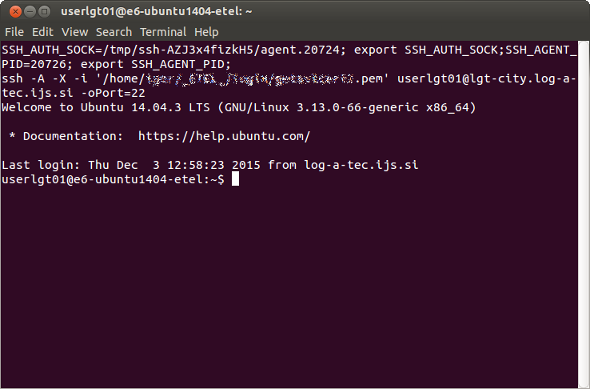

<!-- vim: linebreak filetype=markdown expandtab ts=4 sw=4
-->
<meta charset="utf-8">

# Fed4FIRE LOG-a-TEC Tutorial

## Part 1: Establish a SSH terminal session to a Sensor Cluster Controller (SCC) 

### Getting a Fed4FIRE account and certificate
The [LOG-a-TEC](http://www.log-a-tec.eu/overview.html) testbed is a member of the [Fed4FIRE](http://www.fed4fire.eu/) federation of testbeds. To access it using the Fed4FIRE tools, the user needs a Fed4FIRE account and certificate. More information about how to obtain it can be found on the Fed4FIRE [tutorials](http://www.fed4fire.eu/tutorials/) page.
 
### SFA client tools - jFed Tools
The Fed4FIRE testbed federation is based on SFA (Slice-Based Federation Architecture). SFA-compatible client tools are needed to access and use the Fed4FIRE testbeds. The [jFed](http://jfed.iminds.be/) tools are a set of SFA-compatible tools supporting testbed users (experimenters) as well as developers. The tools are available with GUI (Graphical User Interface) as well as CLI (Command Line Interface).

### Using jFED Experimenter GUI for conducting experiments

To prepare and conduct a testbed experiment, go to the [jFed](http://jfed.iminds.be/) web page and start jFed Experimenter Toolkit (jFED Experimenter GUI) by pressing `Quickstart Experimenter GUI`. In the login window, you must fill in the path to your Fed4FIRE `User certificate` and the certificate `Password`.

Next, click `New` to start defining your new experiment.

Drag `Generic Node` to the drawing board. This will represent a SCC (Sensor Cluster Controller) node. Generally, the graphical editor can be used to place multiple nodes and their interconnections. However, in the LOG-a-TEC case, only a single SCC node is normally defined and used to access the corresponding sensor cluster. Right click the just created node on the drawing board and click `Configure Node`. 

Select the `LOG-a-TEC testbed`, `Specific node`, and then one of the available SCC nodes (`lgt-city.log-a-tec-ijs.si` or `lgt-industrial.log-a-tec-ijs.si`), and `Save`.

Press `Run` in the main window.

This opens a window, where you fill in a name for of your experiment. You can enter the name of your project (registered with your LOG-a-TEC account), or proceed by deselecting `Project`. Click `Start Experiment`.

Wait until the experiment and the node get ready (the node color turns green). Right click the node and click `Open SSH terminal`.

This opens as SSH terminal session on the Sensor Cluster Controller, which is used to prepare and conduct your sensor cluster experiment, as described in the second part of the Fed4FIRE LOG-a-TEC tutorial.

You can open a new SSH terminal session to this node anytime during the lifetime of your experiment, while the node is reserved (provided), with your and your public key installed.

When your reservation period expires or you manually release the resources, any open SSH terminal session is automatically terminated and your public key is uninstalled.

When the node is not provided for you, your public key is not installed. The login will then ask for password (which is not available to the users) and you will not be able to access the node.

