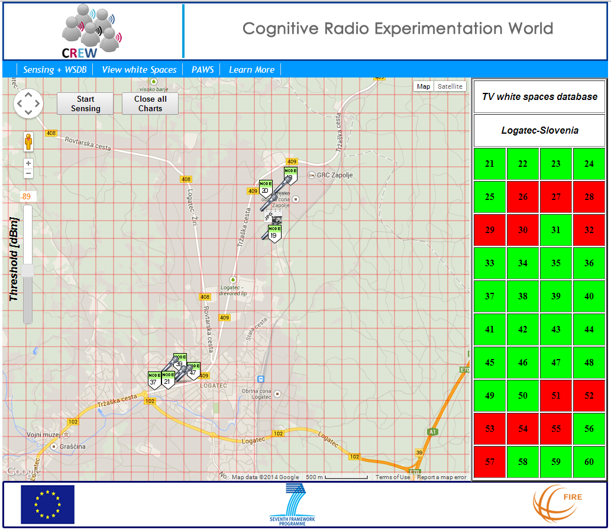

<meta charset="utf-8">

[TOC]

# CREW-TV

## Introduction

TV White Space (TVWS) frequencies are becoming a real world laboratory for experimentation with dynamic spectrum sharing. A challenging aspect for secondary users of TVWS in Europe and US is that the TV band is not only occupied by digital TV broadcasts from fixed transmission towers. In addition, the same part of the spectrum is also used by wireless microphones and other licensed mobile equipment (sometimes called Programme Making and Special Event (PMSE) devices).

Operation of an unlicensed, secondary device in TVWS may be permitted if (and only if) it does not interfere with incumbent services such as digital TV and PMSE transmissions. Such a white space device should either sense the presence of incumbent systems itself or make use of a geo-location database to determine which part of the spectrum is unused in the vicinity.

Current regulation in the US and UK permits the operation of white space devices based on the use of the geo-location database. However it is increasingly recognized that a solution based on both sensing and geo-location databases would allow for more efficient use of the available spectrum. In particular, a geo-location database assisted by a low-cost and densely deployed spectrum monitoring infrastructure is a promising approach to protect incumbent systems, such as wireless microphones, that are typically not registered in geo-location databases.

The CREW-TV experiment was designed to demonstrate the combination of a geo-location database with a spectrum monitoring network. It was performed in March 2014 by [Instituto de Telecomunicações](http://www.it.pt/) and CMSF-Sistemas de Informação with support from the Jožef Stefan Institute as part of the second Open Call of the CREW project.

## Summary of the experiment

The CREW-TV experiment used a network of 8 sensor nodes with the SNE-ISMTV-UHF energy detection receivers to sense the spectrum in a distributed fashion. The nodes were mounted on street lights and other public infrastructure in the Logatec industrial zone and city center clusters. The LOG-a-TEC testbed infrastructure was used to remotely setup the desired sensing parameters (channel bandwidth, central frequencies of interesting channels, etc.) and retrieve the measurement data over the Internet.

A TV signal coverage was computed for the area covered by the testbed based on the data for transmitter locations and powers obtained the national TV broadcaster and the algorithm described in the ECC Report 186. Based on this initial, static data, a geo-location database was implemented. An interface to the database for white space devices was based on a draft version of the IETF Protocol to Access White Spaces (PAWS).

To add dynamic content to the database, a process was implemented that continuously scanned the spectrum in a distributed fashion using the sensor nodes in the testbed. Once a PMSE transmission was detected, the geo-location database was instructed to add an additional exclusion region for white-space devices around the detected PMSE location. In this exclusion area, transmissions of secondary users on frequencies that would interfere with the PMSE transmission were temporarily forbidden.

The system was validated by setting up a white space link from a base station to a mobile terminal that used the experimental database over the PAWS protocol to avoid interference with incumbent users. During a trial operation the spectrum use was monitored from a mobile measurement station using a spectrum analyzer. Several additional sensor nodes in the testbed, equipped with CC1101 transceivers, were used to transmit simulated wireless microphone transmissions to verify the operation of the sensing network. It was verified that the white space link successfully avoided both digital TV broadcasts as well as intermittent PMSE transmissions.

In summary, this experiment was able to showcase the technical feasibility of dynamic spectrum databases, i.e., the combination of a pre-computed white spaces map with real-time information from a distributed sensing network. At regulatory level, such experiments help administrations to recognize the value of spectrum monitoring as part of the progressive approach to managing spectrum more efficiently.

## Further reading

 * [Interactive demo of the CREW-TV database](http://www.cmsf.eu/projects/crew-tv/)

# Game-theoretical interference mitigation

TBD

# Over-the-air programming

TBD
