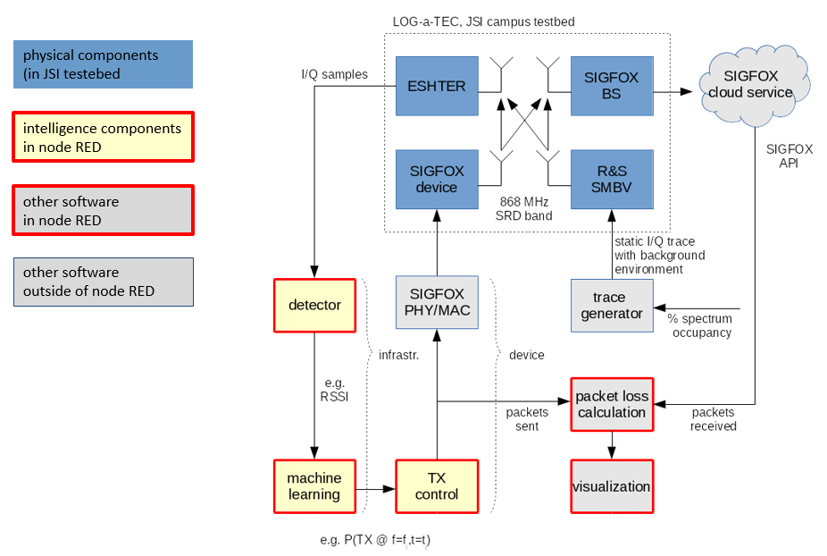

<meta charset="utf-8">

# Overview

The LOG-a-TEC experimental facility is evolving towards a setup in which dense machine type communication (MTC), machine to machine (M2M) and Internet of Things (IoT) technologies can be developed and evaluated. LOG-a-TEC 3.0 extends the [previous version](overview.html) of the facility with LR-WPAN and LPWAN, thus supporting at the same time, long and short range communications. In addition to previously existing [TVWS, clean slate non-IEEE 802.15.4, IEEE 802.15.4](hardware.html), and [custom protocol stacks, spectrum sensing by energy detection and covariance, signal generation including wireless mic profiles, game theoretic power allocation](software.html), LOG-a-TEC 3.0 adds the following new components: 

##Ultra wideband communication using the SNPN-UWB board
The SNPN-UWB board supports communication over UWB channels in the 3.5 GHz to 6.5 GHz frequency bands based on [DecaWave DWM1000](http://www.decawave.com/sites/default/files/resources/dwm1000-datasheet-v1.3.pdf) UWB module. 

##Long range, low power communication using LoRa and the SNN-S272 board

The SNN-S272 board supports long range, low power communication in the 860-1000MHz frequency band based on the [Semtech SX-1272](http://www.semtech.com/wireless-rf/rf-transceivers/sx1272/) transceiver.

##Long range, low power communication using SigFox

In the [elastic Wireless Networking Experimentation (eWINE)](https://ewine-project.eu/) project, we are collaborating with SigFox and have set up a base station at our premises.

Using the SigFox base station, transceivers and the LOG-a-TEC facilities, we are able to perform experiments with the intelligent control of transceivers as depicted in the figure below. 

