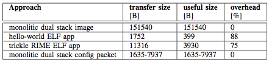
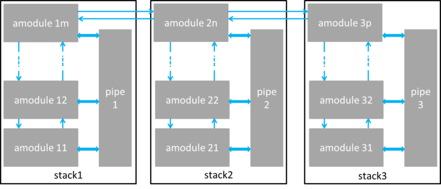

<meta charset="utf-8">

[TOC]

# Software components

## Testbed access using ALH protocol

The testbed can be operated remotely through the LOG-a-TEC web portal. The user can select a cluster of VESNAs and configure them to perform sensing and/or transmission. As a result, the testbed is able to support sensing only experiments, transmission only experiments and also transmission based on sensing results. The LOG-a-TEC web portal also uses the GRASS-RaPlaT tool in order to (i) provide the virtual experiment planning via simulation in order to ascertain the best setup before the actual execution in the testbed as well as (ii) support the postprocessing and visualization of experimentation results.

The Log-a-tec testbed consists of several software components as described in the following sections.

### The management network

This section focuses on user access to the VESNA-based testbed and the technologies behind it.

The wireless management network between nodes is based on a proprietary extension to the IEEE 802.15.4 standard. It is a multihop network, which means that any node is able to communicate with any other node in the cluster, even if it is outside of its direct wireless range.

For the purpose of communication between sensor network and the server located at JSI (infrastructure side) we developed a new protocol (see figure below), which was inspired by the HTTP protocol and is simple enough for fast implementation on VESNA nodes. The protocol defines two types of requests, **GET** and **POST**, which are understood by every VESNA node. **GET** requests are used for "safe" requests which do not change the state of the system and **POST** for "unsafe" requests which change the state of the system. The response from a node to these requests is considered to be in binary format and handled accordingly, although general responses are in text format and only the spectrum sensing data is in binary format. Every response ends with the sequence **OK\r\n** to indicate the end of the response.

The protocol includes simple and efficient error handling mechanism. There are two types of errors defined. The first is **JUNK-INPUT**, which is the more common situation when the resource name is mistyped and the parser on the node does not recognize it. After this response the parser on the node expects five new lines, which resets the parser. Only after that the resource can be accessed again. The second type of error is **CORRUPTED-DATA**, used when cyclic redundancy check (CRC) check did not succeed thus we can conclude that the error happened somewhere on the line between the infrastructure and the gateway. The last situation will occur with very low probability.

The protocol is designed as a client-server protocol. In our case the servers are sensor nodes and the client is the server on the infrastructure side. Before we can access the resources, the gateway has to establish a connection with the infrastructure side. This is done by establishing a secure SSL encrypted socket with the server. The gateway has an Ethernet module embedded on the expansion board which is used to connect the gateway to the Internet. The Ethernet module is configured to get the IP address from DHCP server and then automatically tries to set up an encrypted SSL socket with one of the SSL servers listening on a specific port located on the infrastructure side. Once the connection has been established one could access any resource (sensor, radio module, etc.) or procedure on any of the nodes. Procedures pre-prepared on the nodes include Remote reprogramming, start spectrum sensing, collect spectrum data, configure nodes as transmitters, configure frequency band, etc. Below a simplified schematic of the VESNA-based testbed is provided.

### Testbed access through the web portal

The web app, shown in the figure below, is split in two parts. The right hand side of the graphical user interface (GUI) includes a map where one can observe locations of the nodes and based on the color code distinct between their role in the network (e.g. gateway, ISM band sensing node, TV band sensing node, etc.). The left hand side of GUI is used for the interaction between the user and the testbed. Features in this part of the web app include:

 * **Choosing one of the available clusters**: either at the JSI campus or in Logatec city. Each cluster needs its own SSL server listening on the infrastructure side and by changing the cluster we make a switch to a different SSL server.
 * **Experiment description**: The experiment can be described in a simple text file in which we specify the **GET** and **POST** requests which form our experiment. The commands are separated by an empty line.
 * **Logging support**: All the requests and responses are stored in the request-response log file, where the spectrum sensing data is also collected in the format that corresponds to the CREW common data format.
 * **GET and POST request fields**: The web app also provides an option to send a single manually configured **GET** or **POST** request to the sensor network.
 * **Remote reprogramming support**: For reprogramming the nodes there is an option to select a binary file from a user's local environment and upload it to the server where a special script, written to send the file to the gateway, cuts the file into packets of 512 bytes. Each packet gets a header of 4 bytes containing the serial number of the packet and the footer of 4 bytes with the CRC of the packet. The finished packet is 520 bytes long and gets transferred to the gateway which forwards the packet to the selected end node. The ZigBee packets were extended by an additional layer which can handle packets of this size. The packets are stored on the SD card of the node which is divided into several slots; each slot is able to store one firmware image. After the transfer is complete the node is set to boot the firmware from the requested SD card slot and then rebooted. After a reboot the new firmware is loaded in the flash and started.
 * **Reset SSL connection button**: The web app GUI features also a safety button to reset the system in case of unexpected events that may be caused by bugs or errors in the communication links.

### Testbed access through the exposed HTTP API

As indicated above, the alternative way to access the LOG-a-TEC testbed, mainly supported for the advanced users and developers, is by calling the HTTP API. The call to the API has to meet the specified form for GET and POST requests:

 * https://crn.log-a-tec.eu/communicator?cluster=&quot;port&quot;&amp;method=get&amp;resource=&quot;resource&quot;
 * https://crn.log-a-tec.eu/communicator?cluster=&quot;port&quot;&amp;method=post&amp;resource=&quot;resource&quot;&amp;content=&quot;content&quot;

To make a **GET** or **POST** request we have to make a call to handler called "communicator", which is located on the web server on the LOG-a-TEC infrastructure with the domain name **crn.log-a-tec.eu**. The call is made over secure HTTPS encrypted socket requiring authentication and has to include the following parameters:

 * **The cluster**: This corresponds to the SSL port which the cluster gateway is connected to. The JSI cluster is connected to the port 9501, the Logatec industrial zone cluster to 10001 and the Logatec city center to 10002.
 * **The method**: The method can be either GET or POST.
 * **Resource**: The last parameter in the case of **GET** request is the resource. This corresponds to the resource name located on the target node from one of the clusters.
 * **Content**: The POST request includes also content where we specify the reconfiguration parameters for the nodes.

All the requests that do not meet the specified form are rejected.

The portal can be accessed from <a href="http://www.log-a-tec.eu/">www.log-a-tec.eu</a>, where authentication is necessary to be able to enter. For now the authentication parameters can be added only manually for interested experimenters whereas an automated subscription system with scheduler for the experimenters is under development.

## Testbed access using 6LoWPAN

### Dual-stack Contiki on VESNA

VESNA sensor nodes deployed in the 6LowPAN testbed have two independent transcievers: Texas Instruments CC1101 (868 MHz) and Atmel AT86RF230 (2.4 GHz). Hardware supports the use of both transceivers at the same time. So, while the hardware set-up already supports dual stack (one for management and one for experimentation), a solution for a dual-stack OS had to be developed.

Contiki OS includes two protocol stacks, one based on uIPv6 that can be configured as 6LowPAN/uIPv6/UDP/CoAP and the second protocol stack which is custom and is referred to as Rime. 6LowPAN assumes a IEEE802.15.4 compatible transceiver and since only the Atmel transceivers comply to this, the most natural decision was to consider the Atmel transceivers for the management network and the Texas Instruments transceivers for the experimental network. However, in the normal release of Contiki OS the two stacks cannot run in parallel but only one at a time. This required extension/adaptation of the Contiki OS to support dual stack operation. The original Contiki OS code uses compile-time defined network layers. Some layers are used by both Rime and uIP at the same time (see framer\_nullmac in the figure below), so we modified the networking code to explicitly pass information about which network stack the current packet belongs to. It should be noted that in a single stack Contiki, Rime uses 2 bytes for node network address, while uIP requires 8 bytes. To keep Rime packet small, thus maintaining the low power consumption of the Rime stack, we modified Contiki to permit different network address size for Rime and uIPv6 packets respectively.

Finally, we integrated the new, Composable Rime network stack that enables reconfigurable protocol stacks in the Contiki OS and configured the operating system to support the 6LowPAN based management network and the CRime based experimental network in parallel as depicted in the figure below.

### Software upgrades, reconfiguration and control

Software upgrades require a bootloader running on the VESNA platform and a large image to be sent to the node over the management network. In the case under investigation, the full image of the monolithic dual stack is in the range of 150 kB as shown in the table below. This image corresponds to a particular application (i.e. single experiment) and needs to be changed should another application be needed (i.e. flash the node).

In order to support minor updates of drivers and applications, we used dynamic loading through the Contiki ELF (Executable and Linkable Format) loader module. Our main interest was to enable dynamically reprogrammable network stacks. In other words, we investigated the possibility of transferring new stack compositions, each representing a new experiment. This requires splitting the application into two parts.

The first part, called core, is responsible for loading the minimal Contiki OS with added ELF loader functionality. This part of the node firmware is not changed during reprogramming. It is responsible for downloading the ELF application through the management network and to dynamically link it with the core OS.

To implement it, we had to include the base Contiki image with uIPv6, TCP/UDP and CoAP, also support for:

 * SD card driver and Contiki Coffee FS.
 * Utility application to receive ELF file from network, and write it to a file.
 * ELF loader (generic and CPU architecture specific part) to do actual ELF file relocation.
 * Symbol table stores addresses and names of all core OS functions, which might be called by the ELF application.
 
The second part is the ELF application. The application calls functions exported by the core OS, and is compiled as a standard ELF file. When splitting the previous monolithic dual stack image into core OS (with uIP management network) and ELF application (with CRime experimental network) we have the option to leave some code parts, used only by CRime, in the core OS. In particular, we decided to leave the TI CC radio driver in the core OS. As that particular piece of code is already stable, we expect it will not require frequent updates. This resulted in about 50% smaller ELF application file.

The automatically generated symbol table contains the address and the name of each function in the core. Many of them are not even supposed to be used by the application (low level hardware initialization, static functions, ARM CMSIS library functions). Thus we minimized the core OS image size by excluding unneeded function entries from the symbol table.

We looked at the size of the file to be transferred to the nodes over the air for the very simple hello-world application and for a more complex trickle stack. The size of the hello-world ELF file is 1.7 kB while the size for the trickle ELF file is 11 kB as listed in Table . The trickle ELF application is small compared to the full OS image, but it still does have a significant overhead due to the ELF file metadata.

This observation led us to look at run-time reconfiguration options, where all the CRime modules are loaded on the node using a monolithic system image and then a stack composition message, which describes and configures the experiment, is sent. We used an un-optimized JSON format for the configuration message whose size can vary between 1.6 kB for a simple experiment to 8 kB for a more complex experiment as shown in Table . The code required for parsing the JSON and generating the experiment added additional 7.5 kB to the size of the system image.

### References

 * Cinkelj, Justin, et al. "Design Trade-offs for the Wireless Management Networks of Constraint Device Testbeds", ISWCS 2014, Barcelona, Spain.

## Modular protocol architecture using ProtoStack and CRime

[ProtoStack](https://github.com/sensorlab/ProtoStack) is a reference implementation of a framework that allows composing communication services in a dynamic way. The framework is based on a fine-grained modular protocol stack architecture. The reference implementation of the modular protocol stack architecture is [Composable Rime (CRime)](https://github.com/sensorlab/CRime).

### Components of the framework

The overall framework has four functional components: the physical testbed, the module library, the declarative language, and the workbench as depicted in the figure below.

#### The physical testbed

By physical testbed we refer to a set of machines on which the stack built by the composition of services is deployed and tested. The machines need to support the module library and any additional software that is planned to be deployed. When implementing the framework, the type of machines will determine the selection of the module library, or vice versa. To better represent the likely future deployments, it is desirable that the supported machines of the physical testbeds are as diverse as possible (i.e. heterogeneous). This implies that the module library should be as portable as possible. Further, depending on the location and configuration of the testbed, procedures for resetting the machines in case of fatal errors may be challenging, therefore it is desirable that the deployed binary image is fault proof.

#### The module library

The module library consists of the source code of the modules used for composing communication services. Besides the code for the modules it also contains additional code necessary for compiling and linking the binary image. Depending on the programming language, the modules are implemented as classes or as a set of functions, each in its own file. The modules provide services to each other through interfaces. One module may correspond to a basic service such as routing (e.g. shortest path routing) or may correspond to composite services such as an entire protocol (e.g. IP).

#### The declarative language

The declarative language is used to instantiate and configure modules from the module library. Subsequently, tools that are able to perform validity checking, error detection, compilation of binary images and their deployment in the physical testbed can be used. The declarative language is a natural intermediate level of abstraction between a user interface such as the workbench and the program code. There is a correspondence between elements of the workbench and the elements of the language. A translation tool is employed to translate from the workbench's elements to the declarative language. In some cases, the user may want to bypass the user interface and directly use the language for describing and configuring the modules in a stack prior to the experiment. As a consequence, the language typically also needs to be human readable, possibly easy to learn and should use intuitive code words.

#### The workbench

The workbench is thought of as a control panel which allows the experimenter to configure, start, run, retrieve and visualize the results of an experiment. Therefore the workbench should first and foremost contain functionality that would allow the experimenter to intuitively compose a stack and provide initialization parameters. This is typically achieved by having a region where available modules are listed in graphical and/or textual form (e.g. shortest path routing, transmission control protocol). The modules can then be dragged to a workspace, connected and specific parameters initialized (e.g. time to live, maximum number of retransmissions). Some error checking mechanism should be implemented to ensure that incompatible elements are not wired together and that parameters are inside the permitted ranges. Additionally, the workbench can contain an area where the experiment can be visualized while running (e.g. number of dropped packets, delay) and a summary of the completed experiment can be provided (e.g. total time per operation).

### Requirements for the framework

The framework for dynamic composition of services has to support design and experimentation of new communication services and modular protocol stacks. In order to achieve this, we identify a set of requirements which help fulfill this objective:

* Modularity – the communication services have to have a modular design and implementation to allow composeability of more complex services which can then achieve end to end communication.
* Flexibility – the components of the workbench should be designed and implemented in a way that allows interacting with the resulting tool at different levels of abstractions (e.g. at the module library level, at the workbench level). The components should also be easy to extend and upgrade.
* Easy programming – users with various levels of programming skills should find it easy to use the tools appropriate to their level of experience resulting from the implementation of the framework.
* Reproducibility of experiments – the framework should support re-running and reproducing experiments in an easy way for instance by saving and reloading an experiment description.
* Remote experimentation – remote users should be able to define and perform experiments and download the result. This can be most easily achieved through a web portal.

### The ProtoStack tool

In this section we briefly introduce a reference implementation of the framework for the dynamic composition of services called ProtoStack. We discuss the implementation of the framework and we identify the communities which may find such a tool useful.

The implementation of ProtoStack was triggered by a wireless sensor network testbed and is used for experimentation with cognitive radio and cognitive networking in the framework of the CREW project. As such, ProtoStack is designed in a way to ease research and experimentation with communication networks, particularly with cognitive networks. The system was designed so that

i) an advanced user such as the component developer needs to focus on developing the component and make it work with [Contiki OS](http://www.contiki-os.org/) and

ii) a novice user needs only to focus on composing services in a stack using the workbench.

The physical testbed is based on VESNA sensor network platform to which the Contiki OS has been ported, partly due to the adaptive Rime architecture which comes with it. This physical testbed posed constraints that determined the selection of Composeable Rime (CRime) as the module library.

The CRime module library in the reference implementation is a purpose-built set of protocols influenced by and based on the Rime architecture. The declarative language we selected for ProtoStack is based on the [Resource Description Framework (RDF)](http://www.w3.org/TR/PR-rdf-syntax/), a standard semantic web language. The implementation uses the [Turtle](http://www.w3.org/TeamSubmission/turtle/) syntax together with existing standardized vocabulary and a custom ontology. The workbench is tightly integrated with the language and is implemented using [WireIt](http://neyric.github.com/wireit/), an open source javascript library which enables the creation of full web graph editors.

*ProtoStack: an implementation of the framework for composing communication services. The implementation addresses the sensor networks domain.*

In figure above we illustrate the steps for dynamic composition of services using the ProtoStack tool. The component developer develops a module, manually tests it and makes sure everything works as intended, and, at the end he/she needs to write few lines of Turtle statements (i.e. triples) which specify basic characteristics of the new module (i.e. the name of the module, how many and what type of primitives it implements, etc.). Once this is done, ProtoStack parses the Turtle triples from the new module and stores them in the triple store (arrow 1 in figure). When the user starts using the system, the workbench will be automatically populated with modules based on the statements stored in the triple store and rendered (arrow 2 in figure).

The user will then compose the desired stack, insert the required parameters and press a button to run the stack on the physical testbed (arrow 3 in figure). When such a command is received, the system first checks for consistency by making sure the composition of modules is valid and that the input parameters are in a valid range. If all is fine, some C code is automatically generated based on what the user composed (arrow 4 in figure). This code configures the CRime stack. Finally, the source code is compiled into a binary form representing an image that is uploaded on VESNA (arrow 5 in Figure).

The experiment description resulting from the stack composed and configured by the user is saved and can be re-used at a later time for re-running the same experiment. All this can be done remotely thanks to the web based workbench.

### CRime abstractions

CRime is a new architecture designed to support the composition of communication services which is inspired by and built upon the Rime architecture. CRime introduces three abstractions the amodule, the pipe and the stack.

The **amodule** (short from abstract module) is a generic building block of the CRime stack. Behind each instance of an amodule hides a communication service such as broadcast or multihop. The communication service is an implementation of a network function such as protocol or algorithm and contains only the execution logic of that function. Several amodule instances can be arranged in a pipeline to form a communication stack.

The **pipe** is a vertical structure which can be accessed by any of the modules in a composed stack. The pipe contains only data structures corresponding to parameters that are used by the stack. Pipes are uniquely identified by the channel number they are assigned to, therefore a single channel can only have one associated pipe at a time. This implementation, while not the most efficient approach from a software engineer’s perspective, nor the most resource efficient in terms of memory, instantiates the concept of vertical layer and is the first building block in the implementation of the knowledge plane required for experimentation with cognitive networks. The approach is also a compromise between memory footprint and the complexity required by the autogenerated C code based on user input.

The **stack** is a structure which contains a meaningful sequence of amodules and a pipe. It behaves as a container for these elements and enables the composition of more complex communication services which use more than a single channel at a time. Using the stack abstraction, an independent communication stack can reside on each channel. These stacks merge at the application layer or below it. Figure below depicts the three abstractions in an example of a 1 channel - 1 stack and an example of a 3 channel – 3 stack communication system.

(a) 

(b) 

*Example of CRime stacks: (a) 1 channel – 1 stack example and (b) 3 channel – 3 stack.*

### References

 * Fortuna, C., “Dynamic Composition of Communication Services”. Ljubljana, Slovenia: Jozef Stefan International Postgraduate School, 2013.
 * Dunkels, A., Osterlind, F. and He, Z., “An Adaptive Communication Architecture for Wireless Sensor Networks”, in Proceedings of the ACM Conference on Embedded Networked Sensor Systems, 335–349, 2007, Sydney, Australia.
 * Fortuna, C. and Mohorcic, M., “Dynamic composition of services for end-to-end information transport”, IEEE Wireless Communications Magazine, 2009, Vol. 16.

## GRASS-RaPlaT for experiment planning and visualization of measurements

In order to help experimenter in setting parameters of the experiment, the radio propagation tool <a href="http://www-e6.ijs.si/en/software/grass-raplat">GRASS-RaPlaT</a> is included in JSI Outdoor VESNA-based testbed. GRASS-RaPlaT is an open-source radio planning tool developed at Jožef Stefan Institute as an add-on to the open source Geographical Information Systems (GIS) GRASS. GRASS operates over raster and vector data and includes methods for image processing and display. It comprises over 350 modules for processing, analysis and visualization of geographical data. The core modules and libraries are written in the C programming language. For large projects, processing may be automated by using a scripting language such as Phyton. MySQL, PostgreSQL and DBF database engines are currently supported by GRASS and can be used for storing the data table. In addition, GRASS maps and modules may be imported into other GIS software packages, e.g. Q-GIS.

RaPlaT is a set of modules for a number of channel models, a module for sectorization according to given antenna patterns, a module for calculating and storing the complete radio network coverage data, and a number of supporting modules, e.g. for adapting input data and analyzing simulation results. Thus GRASS-RaPlaT is a powerful tool for designing, analyzing and presenting single node or radio network coverage.

The role of the GRASS-RaPlaT in LOG-a-TEC testbed is (i) to provide support in experiment planning via simulation in order to ascertain the best setup before the actual execution in the testbed and (ii) to support the postprocessing and visualization of experimentation results. An experiment is configured via a web interface and the results of the experiment are also accessible via the web interface. A web server requests the required computation by simply issuing a Linux command with corresponding parameters. This command, which is actually a script, establishes the necessary GRASS environment and executes callbacks of GRASS-RaPlaT or other commands.

The web interface allows configuring nodes either as a transmitter or a receiver. If a particular node is not configured as a transmitter or a receiver, it is assumed as a non-active for the experiment. The main variable parameters for a transmitter are its transmission power and frequency. To provide support in experiment planning, the following preset simulations of radio coverage by GRASS-RaPlaT (&ldquo;virtual experiments&rdquo;) are available: (i) transmission radio coverage estimation, (ii) transmission range estimation (interference area) of the nodes, (iii) estimation of the signal level at the specified receiver locations for all active transmitters, (iv) estimation of the coverage area of all active transmitters and (v) hidden node detection simulation. In the experiments aimed at determining the location of the hidden node based on the measurements obtained from the testbed, GRASS-RaPlaT provides support for the post-processing and visualization of experimentation results and thus calculates the hidden node interference area.

